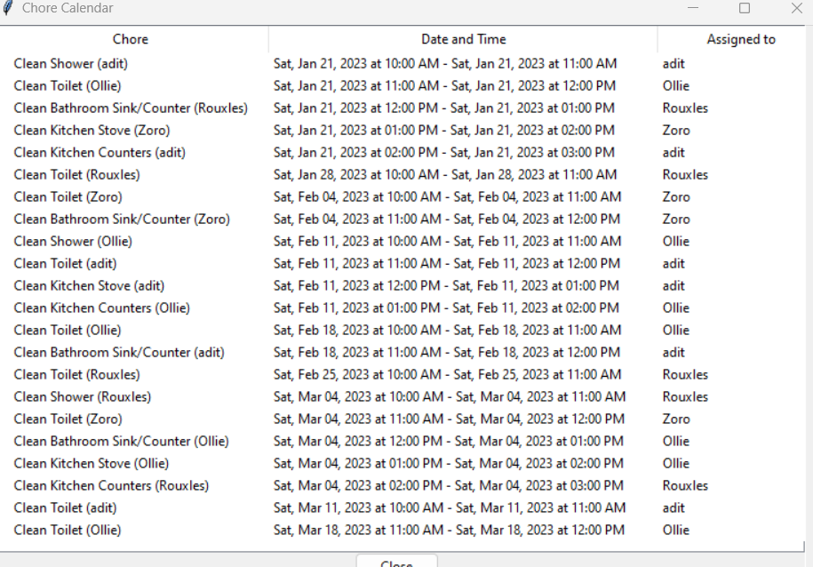

# Chore Calendar Generator

short script to schedule chores with roommates and export data to an .isc file

# How To Use

### Installation

```
# Clone the repository
git clone https://github.com/adit-bala/chores.git

# Enter into the directory
cd chores/

# Install the dependencies
pip install ics
```

### Modifying

To personalize the calendar, adjust the lines that have the `# UPDATE` above them with the appropriate value 

### Exporting

To export your calendar to an .ics file, run `chores.py` in your terminal

```
python3 chores.py
```

Import `chores_calendar.ics` into Google Calendar.


### Keshav's Contributions
##### List Popping
I reversed the order of the popping, prior popping from the end messed up the accuracy of the frequency of the events.

##### Visualizer
Added a method, visualize that allows users to see the chores, and what days they are on prior to uploading the ics file to google calendar. That way, users can make changes, if needed. An example of what it looks like is below.<br>



 
